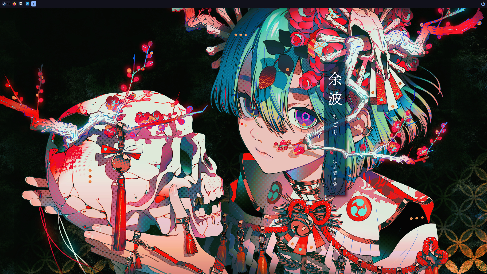
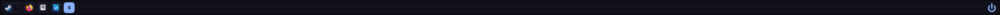
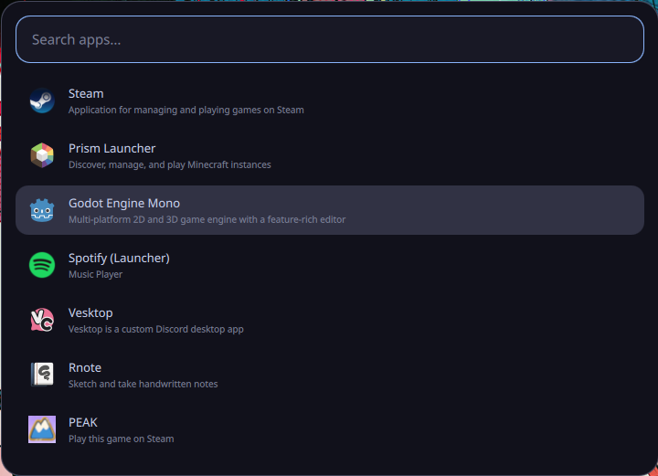
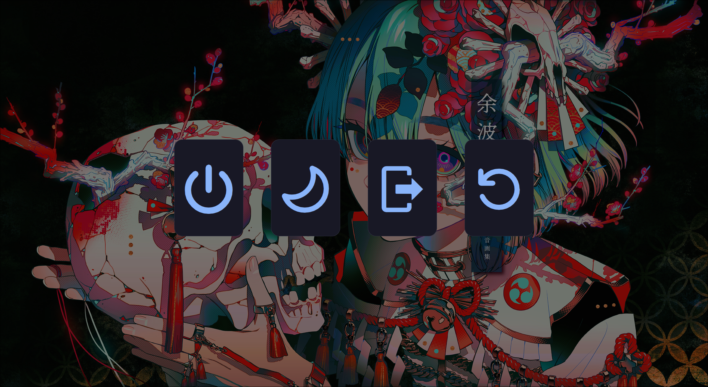
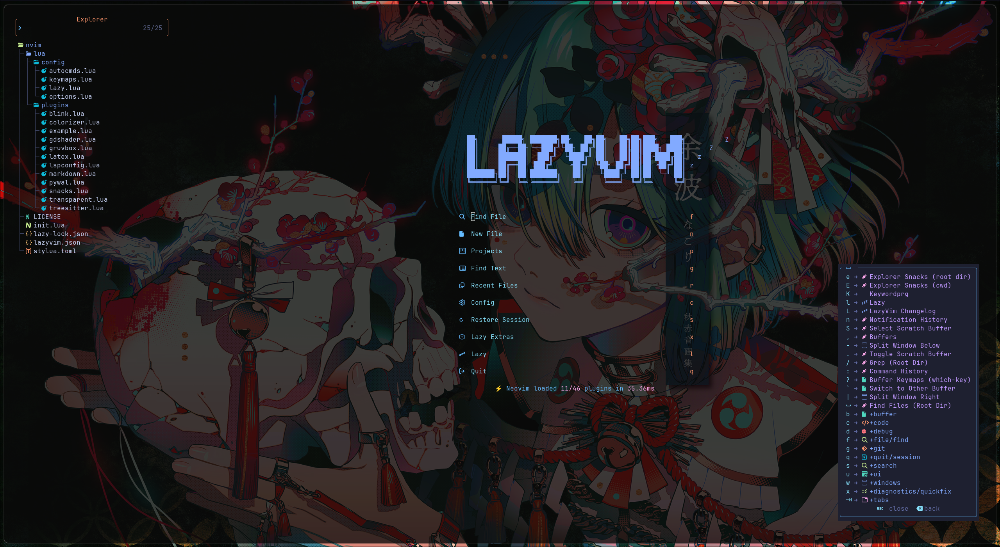
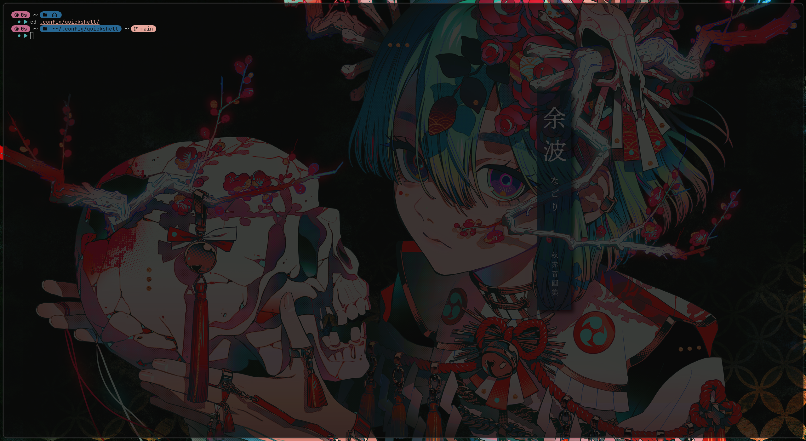

# Arch Linux Hyprland Desktop

My personal Arch Linux + Hyprland desktop configuration.

This repository contains configuration files for my desktop environment, including Hyprland and related applications.

> [!WARNING]
> **Dependencies are not installed automatically.**
>
> These configuration files assume that the required programs, plugins, fonts, libraries, and command-line tools are already installed on the system.
>
> Copying the configuration onto a fresh Arch Linux installation will therefore **not result in a fully working setup by itself**.

## Dependencies

There is currently no installation script or package list that automatically installs everything required by these dotfiles.

You will need to install missing dependencies manually as you encounter them.

This may include:

* Hyprland
* Quickshell
* Neovim
* Fish
* Starship
* Foot
* Wayland utilities
* XDG desktop portal packages
* Fonts and icon fonts
* CLI utilities used by scripts
* Language servers
* Formatters and linters
* Development tools
* Application-specific plugins

The exact dependencies may change as the configuration evolves.

## Neovim

**Neovim is especially likely to show a large number of errors on a fresh installation.**

My Neovim configuration depends on several external programs that are **not installed by Neovim or these dotfiles automatically**.

These can include:

* Language servers
* Compilers
* Formatters
* Linters
* Node.js packages
* .NET tooling
* Python packages
* Lua dependencies
* Git
* npm / Node.js
* External commands used by plugins

As a result, opening Neovim immediately after copying the configuration may produce missing executable errors, failed plugin initialization, unavailable language servers, or other warnings.

Many of these errors simply mean that a dependency expected by the configuration is not installed yet.

Check errors using tools such as:

```bash
nvim
```

and inside Neovim:

```vim
:checkhealth
```

For Lazy.nvim plugins:

```vim
:Lazy
```

For Mason-managed development tools:

```vim
:Mason
```

Install the missing packages appropriate for the languages and tools you actually use.

## Important

These dotfiles are primarily maintained for **my own system**.

They may contain:

* Paths specific to my setup
* Monitor configuration specific to my hardware
* Programs that are not part of a standard Arch installation
* Scripts that expect particular commands to exist
* Configuration for applications you may not use
* Keybindings specific to my workflow

If you use this configuration on another machine, expect to make changes.

## System

Main environment:

```text
OS:             Arch Linux
Display server: Wayland
Compositor:     Hyprland
Shell:          Fish
Terminal:       Foot
Editor:         Neovim
```

## Status

This configuration is actively changed as I modify my desktop setup.

Things may occasionally break, change location, or gain new dependencies without notice.


# Preview

This section contains screenshots and previews of some of the main features included in my desktop configuration.

Replace the placeholder image paths with screenshots from your own repository, for example:

```text
assets/screenshots/desktop.png
```

## Desktop

Overview of the complete Hyprland desktop setup.



---

## Bar

The main desktop bar, including workspaces, system information, and other widgets.



---

## Application Launcher

Application launcher integrated into the desktop environment.



---

## Power Menu

Custom power menu for shutdown, reboot, logout, and other session actions.



---

## Notifications

Desktop notification appearance and behavior.


---

## Neovim

My Neovim development environment.



---

## Terminal

Foot terminal configured to match the rest of the desktop.



---

## File Manager

Dolphin configured as part of the desktop environment.


---

## Lock Screen

Hyprlock configuration.


---

## Additional Features

More screenshots can easily be added using the following template:

```markdown
## Feature Name

Short description of the feature.


---
```

A suggested repository layout for screenshots is:

```text
assets/
└── screenshots/
    ├── desktop.png
    ├── bar.png
    ├── launcher.png
    ├── power-menu.png
    ├── notifications.png
    ├── neovim.png
    ├── terminal.png
    ├── file-manager.png
    └── lock-screen.png
```

